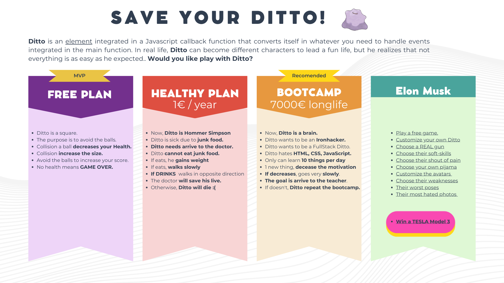
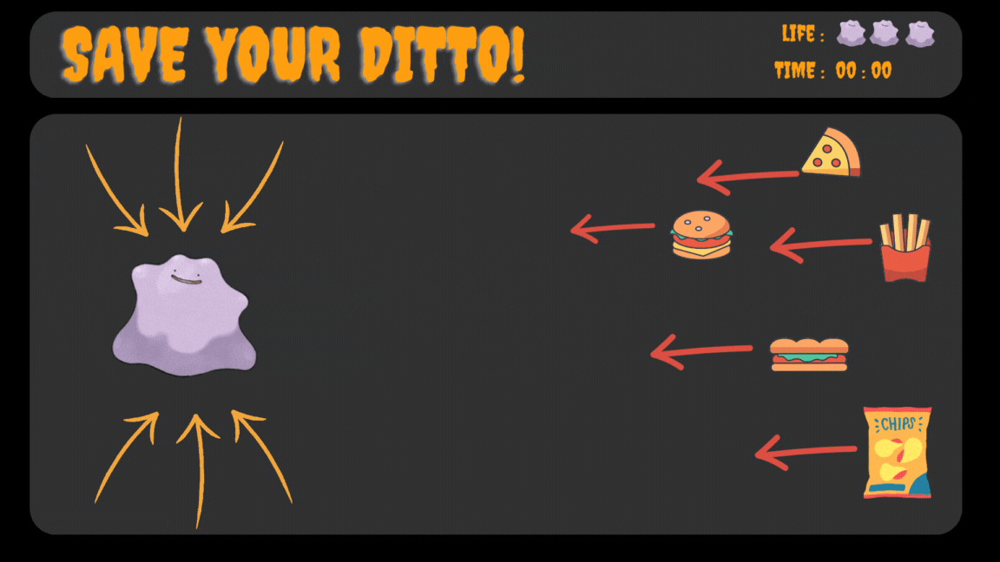

# SAVE YOUR DITTO

## Game Description V.0
In the game 'Save Your Ditto,' your mission is to assist Ditto, a friendly Pokémon who has been consuming fast food excessively at home. 
As a result, his height and size have skyrocketed, and the doctor has warned that this poses a potential threat to his health.
The goal is to extend his lifespan by avoiding this type of food and keeping track of the time you've added to his life.

In the start game Ditto has 3 lifes (3 Ditto)
Each time eat fast food, his life decreases 1 Ditto.

The game is over when Ditto eat 3 fast foods and shows how many time you extended his life.

Can you help Ditto to survive on this fucking world?

### My project Idea

#### GAME SLIDES PRESENTATION : 

https://www.canva.com/design/DAFxvN8-xm4/88a7OImoqZ8wftyiAL3ZyA/edit?utm_content=DAFxvN8-xm4&utm_campaign=designshare&utm_medium=link2&utm_source=sharebutton

#### HTML Backlog
<!DOCTYPE html>
<html lang="en">

<head>
    <meta charset="UTF-8">
    <meta name="viewport" content="width=device-width, initial-scale=1.0">
    <title>Save Your Ditto</title>
    <link rel="stylesheet" href="homepage.css">
</head>

<body class="container">
    <nav class="game-info-banner">

        

        

        

    </nav>
    

       
        <a target="_blank" href="/game-level/ditto-freeplan/index.html" ><button  class="free-plan">PLAY</button></a>
        <a target="_blank" href="/game-level/ditto-eating/index-food.html" ><button  class="ditto-food">BUY</button></a>
        <a target="_blank" href="/game-level/ditto-bootcamp/index-bootcamp.html" ><button  class="ditto-bootcamp">BUY</button></a>

    

   
</body>

</html>

#### CSS Backlog

* {
  padding: 0;
  margin: 0;
  box-sizing: border-box;
}

body {
  height: 100vh;
  display: flex;
  flex-direction: column;
  justify-content: center;
  align-items: center;
  background-color: #f0f0f0; 
  font-family: 'Arial', sans-serif; 
}

.game-board {
  position: relative;
  background-color: #333; 
  width: 80vw;
  height: 80vh;
  overflow: hidden;
  border: 2px solid #ccc;
  border-radius: 15px;
  background-image: url("/img/background.png");
  background-repeat: no-repeat;
  background-size: cover; 
}

.game-board button {
  width: 200px;
  height: 40px;
  border: none;
  border-radius: 5px;
  color: #fff; 
  font-size: 16px;
  cursor: pointer;
  transition: transform 0.2s, background-color 0.3s;
  outline: none;
  
}

.game-board button:hover {
  background-color: #0056B3;
  transform: scale(1.1); 
}

.free-plan {
  position: absolute;
  background-color: #8b22e6; 
  top: 575px;
  left: 110px;
}

.ditto-food {
  position: absolute;
  background-color: #e66842; 
  top: 575px;
  left: 420px;
}

.ditto-bootcamp {
  position: absolute;
  background-color: #f0a431; 
  top: 575px;
  left: 720px;
}

#### JS Backlog

// GameBoard dimensions
const gameBoardWidth = document.querySelector(".game-board").clientWidth;
const gameBoardHeight = document.querySelector(".game-board").clientHeight;
const gameBoardElement = document.querySelector(".game-board");

//getting Game Info Banner
const gameInfoElement = document.querySelector(".game-info-banner")

// getting info Ditto
const ditto = document.querySelector(".ditto");
const dittoWidth = ditto.clientWidth;
const dittoHeight = ditto.clientHeight;

// init Ditto in the GAMEBOARD
let positionYDitto = 300;

let positionXDitto = 80;
let speedDitto = 40;
let dittoHealth = 10;
let fastFoodPassed = 0;
let chooseYourName = "Square"

//init the NAME, DITOHEALTH and SCORE
let dittoName = document.querySelector(".dittoName")
dittoName.textContent = `Name: ${chooseYourName}`
let dittoLife = document.querySelector(".dittoLife")
dittoLife.textContent = `Life: ${dittoHealth}`
let score = document.querySelector(".score")
score.textContent = `Score: ${fastFoodPassed}`

//init fastFoodArray , direction X and Y possible directions 
const fastFoodArray = []
let directionX = "left"
const possibleDirections = ["up", "down"]
function getRandomDirection() {
    const randomIndex = Math.floor(Math.random() * possibleDirections.length);
    return possibleDirections[randomIndex]
}

//getting info and init FastFood 1
const fastFood1 = document.querySelector(".fast-food-1");
let speedFastFood1 = 3;
let directionYFastFood1 = getRandomDirection()
console.log(directionYFastFood1);

//getting info and init FastFood 2
const fastFood2 = document.querySelector(".fast-food-2");
let speedFastFood2 = 3;
let directionYFastFood2 = getRandomDirection()

//getting info and init FastFood 3
const fastFood3 = document.querySelector(".fast-food-3");
let speedFastFood3 = 3;
let directionYFastFood3 = getRandomDirection()

//getting info and init FastFood 3
const objective = document.querySelector(".objective");
let speedObjective = 3;
let directionYObjective = getRandomDirection()

// create the FastFood1
function createFastFood1() {
    const newFastFood1Element = document.createElement("div");
    newFastFood1Element.classList.add("fast-food-1")
    const newFastFood1 = new FastFoodItem1(newFastFood1Element)
    gameBoardElement.appendChild(newFastFood1Element)
    fastFoodArray.push(newFastFood1)
}

// create the FastFood2
function createFastFood2() {
    const newFastFood2Element = document.createElement("div");
    newFastFood2Element.classList.add("fast-food-2")
    const newFastFood2 = new FastFoodItem2(newFastFood2Element)
    gameBoardElement.appendChild(newFastFood2Element)
    fastFoodArray.push(newFastFood2)
}

// create the FastFood3
function createFastFood3() {
    const newFastFood3Element = document.createElement("div");
    newFastFood3Element.classList.add("fast-food-3")
    const newFastFood3 = new FastFoodItem3(newFastFood3Element)
    gameBoardElement.appendChild(newFastFood3Element)
    fastFoodArray.push(newFastFood3)
}

// Launching the FastFood to DITTO in the GAMEBOARD
let frames = 0
function moveFastFood() {
    fastFoodArray.forEach((food, index) => {
        if (directionX === "left") {
            food.positionX += food.speed;

            //food.directionY = getRandomDirection()

            if (food.positionX >= gameBoardWidth - food.element.clientWidth) {
                food.element.remove()
                fastFoodArray.splice(index, 1)
                fastFoodPassed++
            }
        }
        if (food.directionY === "up") {
            food.positionY += 1
            //          food.positionY = getRandomDirection()
        }
        else {
            food.positionY -= food.speed - 2
        }

        if (frames % 140 === 0) {
            food.directionY = getRandomDirection()
        }

        food.element.style.right = `${food.positionX}px`
        food.element.style.top = `${food.positionY}px`

    })
}

function GameOver() {
    if (dittoHealth === 0) {
        const gameIsOver = document.createElement("div")
        gameIsOver.classList.add("gameOver")
        gameIsOver.textContent = "GAME OVER"
        document.body.appendChild(gameIsOver)
        cancelAnimationFrame(animationId)
    }
}

// Creating the Game Animation Frame
let animationId;
function gameAnimationFrame() {
    if (!this.gameIsOver) {
        moveFastFood();
        dittoIsEating();
        frames = frames + 1
        animationId = requestAnimationFrame(gameAnimationFrame);
        if (frames % 150 === 0) {
            createFastFood1()
        }
        else if (frames % 90 === 0) {
            createFastFood2()
        }
        else if (frames % 120 === 0) {
            createFastFood3()
        }
        
        GameOver()
    }
}
gameAnimationFrame();

console.log("fastfood.js is working!");

class FastFoodItem1 {
    constructor(element) {
        this.element = element;
        this.speed = speedFastFood1;
        this.directionY = getRandomDirection()
        this.directionX = "left";
        this.positionX = 0;
        this.positionY = 500;
        // this.foodimage = foodimage;
    }
}
class FastFoodItem2 {
    constructor(element) {
        this.element = element;
        this.speed = speedFastFood2;
        this.directionY = getRandomDirection()
        this.directionX = "left";
        this.positionX = 0;
        this.positionY = 100;
        // this.foodimage = foodimage;
    }
}

class FastFoodItem3 {
    constructor(element) {
        this.element = element;
        this.speed = speedFastFood3;
        this.directionY = getRandomDirection()
        this.directionX = "left";
        this.positionX = 0;
        this.positionY = 300;
        // this.foodimage = foodimage;
    }
}

console.log("ditto.js is working!");

// controlling movement Ditto inside the GameBoard
function moveDitto(event) {
    if (event.key === "ArrowUp") {
        if (positionYDitto >= 0) {
            positionYDitto -= speedDitto;
        }
    } else if (event.key === "ArrowDown") {
        if (positionYDitto + dittoHeight <= gameBoardHeight) {
            positionYDitto += speedDitto;
        }
    } else if (event.key === "ArrowLeft") {
        if (positionXDitto >= 0) {
            positionXDitto -= speedDitto;
        }
    } else if (event.key === "ArrowRight") {
        if (positionXDitto + dittoWidth <= gameBoardWidth) {
            positionXDitto += speedDitto;
        }
    }
    ditto.style.top = `${positionYDitto}px`;
    ditto.style.left = `${positionXDitto}px`;
    //check if ditto is eating
    //dittoIsEating();
}

// detecting Ditto movement
document.addEventListener("keydown", moveDitto);

// Check the COLLISIONS
function dittoIsEating() {
    const dittoPosition = ditto.getBoundingClientRect();
    document.querySelector(".dittoLife").textContent = `Health: ${dittoHealth}`
    document.querySelector(".score").textContent = `Score: ${fastFoodPassed}`
    document.querySelector(".dittoName").textContent = `Hello, ${chooseYourName}`
    for (let i = 0; i < fastFoodArray.length; i++) {
        const fastFood = fastFoodArray[i];
        const positionFastFood = fastFood.element.getBoundingClientRect();

        if ( // ditto is EATING!
            dittoPosition.x < positionFastFood.x + positionFastFood.width &&
            dittoPosition.x + dittoPosition.width > positionFastFood.x &&
            dittoPosition.y < positionFastFood.y + positionFastFood.height &&
            dittoPosition.y + dittoPosition.height > positionFastFood.y
        ) {
            speedDitto --;
            dittoHealth--;
            fastFoodArray.splice(i, 1); // Remove the fast food from the array
            fastFood.element.remove() // Remove from the screen the fastFood
            ditto.style.width = ditto.clientWidth + 10 + "px"; // increase Ditto width
            ditto.style.height = ditto.clientHeight + 10 + "px"; // increase Ditto Height
        }
}
}

