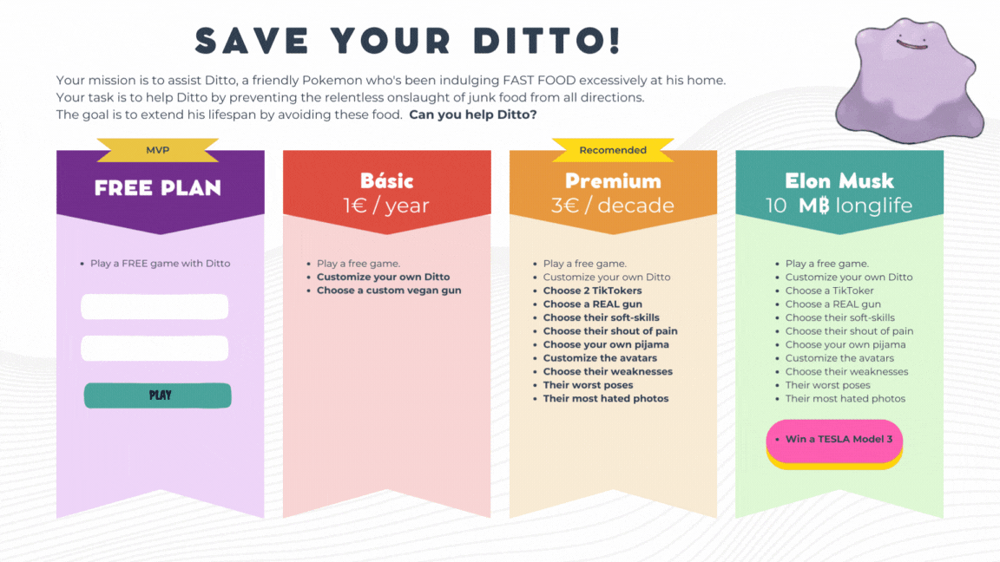

# SAVE YOUR DITTO

## Game Description

In the game 'Save Your Ditto,' your mission is to assist Ditto, a friendly Pokémon who has been consuming fast food excessively at home. 
As a result, his height and size have skyrocketed, and the doctor has warned that this poses a potential threat to his health.

The goal is to extend his lifespan by avoiding this type of food and keeping track of the time you've added to his life.

In the start game Ditto has 3 lifes (3 Ditto)
Each time eat fast food, his life decreases 1 Ditto.

The game is over when Ditto eat 3 fast foods and shows how many time you extended his life.

Can you help Ditto to survive on this fucking world?

### My project Idea

#### HTML Backlog

index.html
    background image
    choose your Name
    choose your Ditto colour
    play button

game.html
    div navigation bar
        Title of Game
    
    div game board
        Ditto
        Fast Food

    div bottom part
        Ditto Life
        Time Counter

#### CSS Backlog

styles.css

#### JS Backlog

scripts.js

